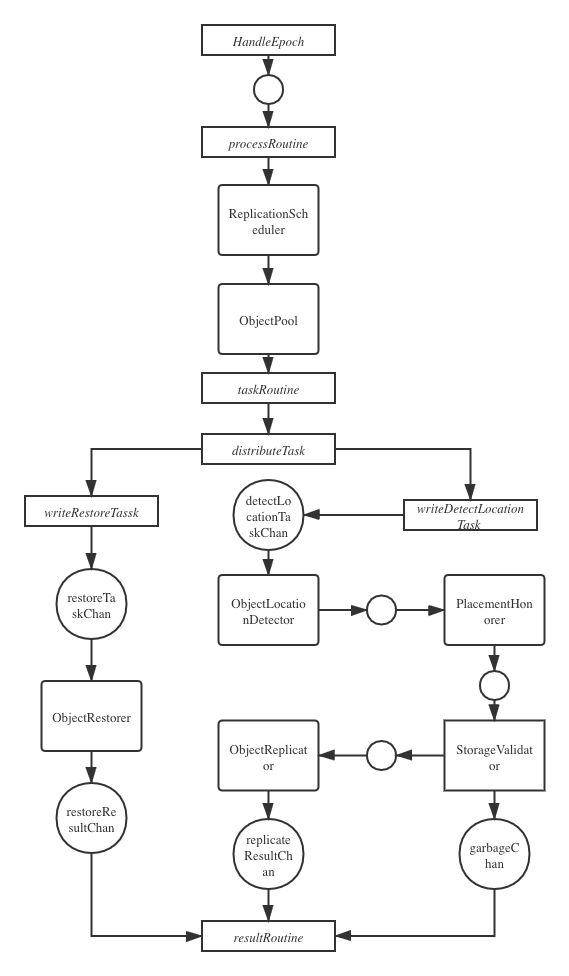

# Replication

## [AddressStore](./SelectiveContainerExecutor.md#AddressStore)

## MultiSolver

|Field|Type|Description|
|-|-|-|
|as|AddressStore||
|pl|placement.Component||

* *Epoch()*

  返回当前时隙

* *SelfAddr()*

  返回自身的钱包地址

* *ReservationRatio(ctx context.Context, addr Address) (int, error)*

  获取某个container中指定objectID的应该存储的节点个数

* *SelectRemoteStorages(ctx context.Context, addr Address, excl ...multiaddr.Multiaddr) ([]ObjectLocation, error)*

  根据address(cid, objectId)返回应该进行存储的node列表，排除excl中节点地址和自己，WeightGreater在自己之前的为true，自己之后的为false

* *selectNodes(ctx context.Context, addr Address, excl ...multiaddr.Multiaddr) ([]multiaddr.Multiaddr, error)*

  根据cid和objectId获取节点列表，并排除excl中的节点

* *Actual(ctx context.Context, cid CID) bool*

  从netmap中判断自身是否应该 存储cid

* *CompareWeight(ctx context.Context, addr Address, node multiaddr.Multiaddr) int*

  比较自身和另一个节点的权重，获取同一个cid的节点列表，谁靠前谁大

## ObjectPool

是为了数据审计选择的object队列，每一个时隙只会更新一次

|Field|Type|Description|
|-|-|-|
|mu|\*sync.Mutex|锁|
|tasks|[]Address|需要的cid, objectId|

* *Update(pool []Address)*

  跟新tasks = pool

* *Undone() int*

  返回tasks个数

* *Pop() (Address, error)*

  返回第一个task

## ReplicationScheduler

|Field|Type|Description|
|-|-|-|
|cac|ContainerActualityChecker| MultiResolver|
|ls|localstore.Iterator| LocalStore |

* *SelectForReplication(limit int) ([]Address, error)* 

  根据本地存储遍历，直到非应该存储的object_address达到limit或者遍历完成，返回非本地应该存储的object_address,如果个数达不到，用随机的应该存储的object_address来填充

## LocalIntegrityVerifier

### localHeadIntegrityverifier

|Field|Type|Description|
|-|-|-|
|keyVerifier|core.OwnerKeyVerifier| 根据owner_key校验owner_id|

* *Verify(ctx context.Context, obj \*Object) error*

  首先如果object的header中包含TokenHdr就从TokenHeader中取出token作为ownerKeyContainer然后token.GetSessionKey序列化作为checkKey, 如果只包含PulickKeyHeader则使用OwnerId和Header_PublicKey构建headerOwnerKeyContainer作为ownerKeyContainer, 序列化Header_PublicKey作为checkKey, 使用keyVerifier校验ownerKeyContainer, 使用checkKey校验object的IntegrityHeader中的签名

### payloadVerifier

* *Verify(_ context.Context, obj \*Object) error*

  获取object的PayloadCheckSumHeader， 如果没有直接返回错误，使用sha256计算object.Payload将计算结果与PayloadChecksumHeader中的checksum进行对比，如果不一致返回错误
  
|Field|Type|Description|
|-|-|-|
|headVerifier|localHeadIntegrityVerifier||
|payloadVerifier|payloadVerifier||

* *Verify(ctx context.Context, obj 、*Object) error*

  先使用headVerifier校验IntegrityHeader然后使用payloadVerifier校验payload

## ObjectValidator

|Field|Type|Description|
|-|-|-|
|as  |     AddressStore|[AddressStore](./SelectiveContainerExecutor.md#AddressStore) |
|ls   |    localstore.Localstore|[localstore](../LocalStore/localstore.md)|
|executor| SelectiveContainerExecutor|[SelectiveCotnainerExecutor](./SelectiveContainerExecutor.md)|
|log   |   \*zap.Logger|日志|
|saltSize  | int ||
|maxRngSize |uint64||
|rangeCount| int||
|sltr    |   Salitor||
|verifier |  objutil.Verifier|[LocalIntegrityVerifier](#LocalIntegrityVerifier)|

* *Verify(ctx context.Context, params \*replication.ObjectVerificationParams) bool*

  根据本地地址和params中node的地址判断调用verifyLocal或者verifyRemote

* *verifyLocal(ctx context.Context, addr Address) bool*

  从localstore中获取obj然后使用LocalIntegrityVerifier校验

* *verifyRemote(ctx context.Context, params \*replication.ObjectVerificationParams) bool*

  使用executor获取obj headers然后根据header中信息判断然后如果本地也存在此obj就通过verifyThroughHashes来校验，如果没有，就调用executor.Get来获取obj然后获取完成后处理函数中执行校验

* *verifyThroughHashes(ctx context.Context, obj \*Object, node multiaddr.Multiaddr) (valid bool)*

  根据Saltor生成salt然后根据payloadLength和配置中maxRangeSize和rangeCount远程调用RangeHash,来获取Hashes.得到hash后与本地的object.payload的计算结果对比

## PlacementHonorer

### ObjectStorage

|Field|Type|Description|
|-|-|-|
|ls|LocalStore|[localstore](../LocalStore/localstore.md)|
|executor|SelectiveContainerExecutor |[SelectiveCotnainerExecutor](./SelectiveContainerExecutor.md)|
|log|Logger||

* *Put(ctx context.Context, params replication.ObjectStoreParams) error*

### PlacementHonorer

  检查obj是否为nil, 如果不指定nodes且存在localstore，则保存到本地。如果指定了nodes则向每个node Put.

* *Get(ctx context.Context, addr Address) (res \*Object, err error)*

  如果存储在本地直接从localstore获取，如果本地没有则通过executor从其他节点获取

|Field|Type|Description|
|-|-|-|
|objectSource|ObjectSource|[ObjectStorage](#ObjectStorage)|
|objectReceptacle|ObjectReceptacle |[ObjectStorage](#ObjectStorage)|
|remoteStorageSelector|RemoteStorageSelector|[MultiSolver](#MultiSolver)|
|presenceChecker|PresenceChecker|[localstore](../LocalStore/localstore.md)|
|log|Logger|日志|
|taskChanCap||配置文件中读取|
|resultTimeout||配置文件中读取|

* *Process(ctx context.Context) chan<- \*ObjectLocationRecord*

  将resultChan设置为ch

* *Subscribe(ch chan<- \*ObjectLocationRecord*

  创建一个channel传递类型为ObjectLocationRecord然后起一个goroutine调用processRoutine监听此channel，将channel返回

* *writeResult(locationRecord \*ObjectLocationRecord)*

  向resultChan写入locationRecord

* *processRoutine(ctx context.Context, taskChan <-chan \*ObjectLocationRecord)*

  读取channel，如果收到了ObjectLocationRecord检查本地是否存储了指定的address，如果没有返回。如果本地有存储，调用handleTask

* *handleTask(ctx context.Context, locationRecord \*ObjectLocationRecord)*

  使用RemoteStorageSelector获取需要存储address的节点，然后跟locationRecords里面对比，如果locationRecord里面不包含应该存储的节点信息，将nodeinfo添加到其中然后向所有locationRecord.Locations中Put object

## LocationDetector

查找所有存储了address指定的object的节点列表

### ObjectLocator

|Field|Type|Description|
|-|-|-|
|executor|SelectiveContainerExecutor|[SelectiveCotnainerExecutor](./SelectiveContainerExecutor.md) |
|log|Logger|打印日志|

* *LocateObject(ctx context.Context, addr Address) (res []multiaddr.Multiaddr, err error)*

  根据address返回实际的存储节点网络地址列表

### ObjectLocationDetector

|Field|Type|Description|
|-|-|-|
|weightComparator|WeightComparator|[MultiSolver](#MultiSolver)|
|objectLocator|ObjectLocator|[ObjectLocatoer](#ObjectLocater)|
|reservationRatioReceiver|ReservationRatioReceiver|[MultiSolver](#MultiSolver)|
|presenceChecker|PresenceChecker|[localstore](../LocalStore/localstore.md)|
|log|Logger|输出日志|
|taskChanCap|TaskChanCap|配置文件读取|
|resultTimeout|ResultTimeout|配置文件读取|
|resultChan|chan<- *ObjectLocationRecord||

* *Subscribe(ch chan<- \*ObjectLocationRecord)*

  将resultChan设置为ch,

* *Process(ctx context.Context) chan<- Address*

  创建一个channel传递类型为Address, 然后启动processRoutine监听此channel，并将channel返回

* *writeResult(locationRecord \*ObjectLocationRecord)*

  将locationRecord写入resultChan

* *processRoutine(ctx context.Context, taskChan <-chan Address)*

  监听taskChan, 如果收到address就使用localstore检查本地是否存在，如果不存在调用handleTask

* *handleTask(ctx context.Context, addr Address)*

  使用MutiSolver.ReservationRatio方法，获取指定addresss的存储节点并返回个数。然后使用ObjectLocator获取实际存储的节点列表并使用weightComparator计算WeightGreater组成ObjectLocation添加到locationRecord中，最后调用writeResult将locationRecord写入channel

## StorageValidator

对所有locations中存储了object的节点进行object验证，根据ReservationRatio计算shortage

|Field|Type|Description|
|-|-|-|
|ObjectVerifier|ObjectVerifier|[ObjectVirifier](#ObjectVerifier)|
|log|Logger|打印日志|
|presenceChecker|PresenceChecker|[localstore](../LocalStore/localstore.md)|
|taskChanCap|TaskChanCap|配置文件读取|
|resultTimeout|ResultTimeout|配置文件读取|
|addrstore|AddrStore|[AddressStore](./SelectiveContainerExecutor.md#AddressStore)|

* *SubscribeReplication(ch chan<- \*ReplicateTask)*

  将replicateResultChan设置为ch

* *SubscribeGarbage(ch chan<- Address)*

  将garbageChan设置为ch

* *Process(ctx context.Context) chan<- \*ObjectLocationRecord*

  创建一个传递类型为ObjectLocationRecord的channel，然后调用processRoutine进行监听，并返回此channel

* *writeReplicateResult(replicateTask \*ReplicateTask)*

  将relicateTask写入replicationResultChannel

* *writeGarbage(addr Address)*

  将address写入garbageChan

* *processRoutine(ctx context.Context, taskChan <-chan \*ObjectLocationRecord)*

  监听channel，如果收到ObjectLocationRecord然后检查本地是否存储，如果没有执行handleTask

* *handleTask(ctx context.Context, locationRecord \*ObjectLocationRecord)*

  遍历所有ObjectLocationRecord中的Locations, 校验其中的object，并统计shortage，如果shortage大于0，就将shortage计入ReplicationTask调用writeReplicationResult写入replicationResultChannel, 如果所有Location中WeightGreater的数量大于Object的ReservationRatio，就调用wirteGarbage将address写入garbageChan

## ObjectReplicator

根据task中的shortage数量向应该存储object的节点推送object

|Field|Type|Description|
|-|-|-|
|objectReceptacle  |    ObjectReceptacle|[ObjectStorage](#ObjectStorage)|
|remoteStorageSelector |RemoteStorageSelector|[MultiSolver](#MultiSolver)|
|objectSource     |     ObjectSource|[ObjectStorage](#ObjectStorage)|
|presenceChecker    |   PresenceChecker|[localstore](../LocalStore/localstore.md)|
|log        |           *zap.Logger|日志输出|
|taskChanCap |  int|配置中读取|
|resultTimeout |time.Duration|配置中读取|
|resultChan  |  chan<- *ReplicateResult|nil|

* *Subscribe(ch chan<- \*ReplicateResult)*

  将resultChan设置为ch

* *Process(ctx context.Context)*

  创建一个传递类型为ReplicationTask的channel，调用processRoutine来监听，并将此channel返回

* *writeResult(replicateResult \*ReplicateResult)*

  将replicateResult写入resultChan

* *processRoutine(ctx context.Context, taskChan <-chan \*ReplicateTask)*

  监听taskChan, 如果收到replicateTask并且本地存储了相应的object则调用handleTask处理

* *handleTask(ctx context.Context, task \*ReplicateTask)*

  获取task.Address指定的object，从MultiSolver获取应该存储指定object的节点并附带WeightGreater属性，然后依次调用object.Put将object发送给这些节点

## Restorer

如果本地没有存储object，从存储了object的其他节点获取object并校验，然后存储到本地

|Field|Type|Description|
|-|-|-|
|objectVerifier   |     ObjectVerifier|[ObjectvValidator](#ObjectValidator)|
|remoteStorageSelector |RemoteStorageSelector|[MultiSolver](#MultiSolver)|
|objectReceptacle  |    ObjectReceptacle|[ObjectStorage](#ObjectStorage)|
|epochReceiver    |     EpochReceiver|[MultiSolver](#MultiSolver)|
|presenceChecker  |     PresenceChecker|[localstore](../LocalStore/localstore.md)|
|log       |            *zap.Logger|日志输出|
|taskChanCap |  int|配置中读取|
|resultTimeout |time.Duration|配置中读取|
|resultChan |   chan<- Address|nil|

* *Subscribe(ch chan<- Address)*

  将resultChan设置为ch

* *Process(ctx context.Context)*

  创建一个传递参数为Address的channel，然后调用processRoutine监听，并返回此channel

* *writeResult(refInfo Address)*

  将address写入resultChan

* *processRoutine(ctx context.Context, taskChan <-chan Address)*

  监听taskChan，如果收到address并且本地包含此object，就调用handleTask处理

* *handleTask(ctx context.Context, addr Address)*

  从MutiSolver中获取所有应该存储object的节点尝试从节点获取object并校验，如果成功然后存储到本地

## ReplicationManager

### GarbageStore

没有完整实现

|Field|Type|Description|
|-|-|-|
||*sync.Mutex|互斥锁|
|Items|[]Address|垃圾列表|

* *put(addr Address)*

  将addrees放入列表，如果已经存在直接返回

### ReplicationManager

|Field|Type|Description|
|-|-|-|
|objectPool   |  ObjectPool |[ObjectPool](#ObjectPool)|
| managerTimeout| time.Duration||
|objectVerifier| ObjectVerifier|[ObjectValidator](#ObjectValidator)|
| log     |       *zap.Logger|日志输出|
|locationDetector| ObjectLocationDetector|[ObjectLocationDetector](#ObjectLocationDetector)|
| storageValidator |StorageValidator|[StorageValidator](#StorageValidator)|
|replicator   |    ObjectReplicator|[ObjectReplicator](#ObjectReplicator)|
| restorer     |    ObjectRestorer|[ObjectRestorer](#ObjectRestorer)|
|placementHonorer| PlacementHonorer|[PlacementHonorer](#PlacementHonorer)|
|detectLocationTaskChan| chan<- Address|internal task channels|
|restoreTaskChan   |     chan<- Address|internal task channels|
|pushTaskTimeout |time.Duration|配置中读取|
|replicationResultChan| <-chan *ReplicateResult|internal result channels|
|restoreResultChan   |  <-chan Address|internal result channels|
|garbageChanCap  |       int|配置中读取|
|replicateResultChanCap| int|配置中读取|
|restoreResultChanCap |  int|配置中读取|
|garbageChan  |<-chan Address||
|garbageStore |*garbageStore|[GarbageStore](#GarbageStore)|
|epochCh  | chan uint64||
|scheduler| Scheduler|[ReplicationScheduler](#ReplicationScheduler)|
|poolSize  |        int|配置中读取|
|poolExpansionRate| float64|配置中读取|

* *Name() string*

  返回 "BEAGLE_REDUNDANT_COPIES"

* *HandleEpoch(ctx context.Context, epoch uint64)*

  注册到MorphClient监听到new epoch事件时触发。

  将epoch写入epoch channel

* *Process(ctx context.Context)*

  启动[ObjectRestorer](#ObjectRestorer)并将返回的channel设置给restoreTaskChan, 创建一个传递类型为adress的channel赋值给restoreResultChan, 并用其订阅[ObjectRestorer](#ObjectRestorer)的结果通道

  启动[ObjectLocationDetector](#ObjectLocationDetector)并将返回的channel赋值给detectLocationTaskChan

  启动[StorageValidator](#StorageValidator)的process过程并将返回的channel作为结果通道订阅到[PlacementHonorer](#PlacementHonorer)

  启动[PlacementHonorer](#PlacementHonorer)的process过程，并将返回的channel作为结果通道订阅到[ObjectLocationDetector](#ObjectLocationDetector)

  创建一个传递参数为ReplicationResult的channel作为结果通道订阅到[ObjectReplicator](#ObjectReplicator),并将其赋值给replicateResultChan

  启动[ObjectReplicator](#ObjectReplicator)的process过程，并将返回的channel作为结果通道订阅到[StorageValidator](#StorageValidator)

  创建一个传递参数为address的channel作为结果通道订阅到[StorageValidator](#StorageValidator)

  启动taskRoutine和resultRoutine,调用processRoutine

* *writeDetectLocationTask(addr Address)*

  向detectLocationTaskChan写入address

* *writeRestoreTask(addr Address)*

  向restoreTaskChan写入address

* *resultRoutine(ctx context.Context)*

  如果收到了restoreResultChan的address打印日志提示成功restored object

  如果收到了replicationChan的打印日志提示成功replicated

  如果收到了garbageChan的address，调用[GarbageStore](#GarbageStore).Put写入

* *taskRoutine(ctx context.Context)*

  如果objectpool中又任务取出address，则调用distributeTask

* *processRoutine(ctx context.Context)*

  当监听到epochCh有新的时隙到达时，调用[ReplicationScheduler](#ReplicationScheduler)的*SelectForReplication*方法返回需要处理的所有任务，然后如果[ObjectPool](#ObjectPool)中有为完成任务, 则将新任务中减去未完成任务数，更新到ObjectPool中，如果没有未完成的任务，则根据扩展比率适当扩大一定比率的任务，更新到ObjectPool

* *distributeTask(ctx context.Context, addr Address)*

  首先使用[ObjectValidator](#ObjectValidator)校验address指定的object，然后如果校验失败，调用wirteRestoreTask(addr)

  调用writeDetectLocationTask(addr)

  