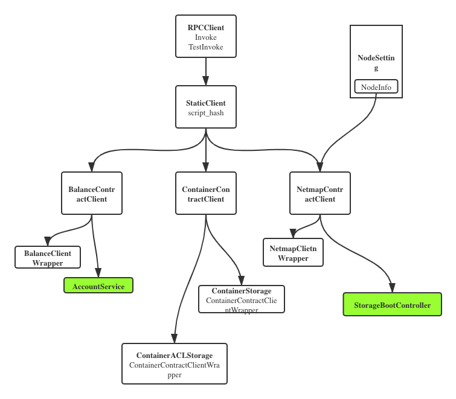

## Morph

主要功能是调用neofs相关的合约，将rpcclient包装成可以直接调用的方法，对应合约的方法通过rpc来调用合约。

### EventListener

    这部分是相对独立的部分，主要功能是利用neo-go的websocket端口来监听区块链事件，neo-core目前不支持。
    分成subscriber和listener两部分
#### Subscriber

    向neo-go节点订阅合约的notification事件

|Field|Type|Description|
|-|-|-|
|RWMutex|sync.RWMutex|读写锁|
|log|*zap.Logger|日志输出|
|client|*client.WSClient|neo-go websocket client|
|notify|chan *result.NotificationEvent| 传输NotificationEvent的channel|
|notifyIDs|map[util.Uint160]string| 存储合约对应的notifyID|

* SubscribeForNotification(contracts []UInt160) (<-chan *result.NotificationEvent, error)
使用neo-go中wsclient提供的SubscribeForExecutionNotifications方法订阅contracts指定合约的notification，通过返回的channel获取NotificationEvent

* UnsubscribeForNotification()
取消订阅所有已经订阅合约的notification事件

* routeNotifications
监听wsclient.Notification channel，如果收到NotificationEvent事件，发送到notify channel

#### Listener

启动时注册需要监听的合约，运行时当收到相应的NotificationEvent后，使用已经注册的pareser来处理Notification内容并执行handler。

|Field|Type|Description|
|-|-|-|
|mtx|*sync.RWMutex|读写锁|
|	once |*sync.Once|保证只运行一次|
|started |bool|启动标志|
|parsers |map[scriptHashWithType]Parser|解析器|
|handlers |map[scriptHashWithType][]Handler|执行方法|
|log |*zap.Logger|日志输出|
|subscriber |subscriber.Subscriber|订阅管理器|

* Listen(ctx context.Context)
启动事件监听

* listen(ctx context.Context) error
根据注册的所有parser使用Subscriber订阅所有合约并启动监听循环

* listenLoop(ctx context.Context, chEvent <-chan *result.NotificationEvent)
监听循环，接收到NotificationEvent后调用parseAndHandle

* parseAndHandle(notifyEvent *result.NotificationEvent)
使用parse解析Notification参数，然后在执行handler

* SetParser(p ParserInfo)
设置指定合约和时间的解析器

* RegisterHandler(p HandlerInfo)
注册指定合约和事件的处理器

### RPCClient

包含wallet.Account的rpc客户端，Account由配置文件中的私钥来创建

|Field|Type|Description|
|-|-|-|
|logger|*logger.Logger|日志输出|
|client|*client.Client|rpc client|
|acc |*wallet.Account|用于支付network fee并签名的账户|

* Invoke(contract util.Uint160, fee util.Fixed8, method string, args ...interface{}) error
调用rpc的invokefunction方法获取script并添加networkfee，使用sendrawtransaction发送交易并上链

* TestInvoke(contract util.Uint160, method string, args ...interface{}) ([]sc.Parameter, error)
调用rpc的invokefunction方法查询结果，不上链

### MorphContracts

使用rpcclient构造每个合约的StaticClient并将配置中合约事件的parser和handler注册到EventListener

#### BalanceContractClient
使用BalanceStaticClient将balanceContract对应的方法封装成函数可以直接调用

|Field|Type|Description|
|-|-|-|
|client|*client.StaticClient|static balance contract client|
|cfg.balanceMethod|string|balance合约的balanceof方法名|
|cfg.decimalsMethod |string|balance合约的decimals方法名|

* BalanceOf(args GetBalanceOfArgs) (*GetBalanceOfValues, error)
通过invokefunction获取指定地址的余额

* Decimals(args DecimalsArgs) (*DecimalsValues, error)
通过invokefuntion获取decimals

##### BalanceContractClientWrapper
将BalanceContractClient封装了一层，把参数返回值类型优化

##### Accounting.Service
实现为accService
|Field|Type|Description|
|-|-|-|
|contractClient|*client.StaticClient|static balance contract client|

* Name() string
返回service名称

* Register(g *grpc.Server)
将service注册到gprc.Server

* Balance(ctx context.Context, req *accounting.BalanceRequest) (*accounting.BalanceResponse, error)
处理balanceof的grpc请求，通过balanceContractClient获取余额后返回response

#### ContainerContractClient
使用ContainerStaticClient将ContainerContract对应的方法封装成函数可以直接调用

|Field|Type|Description|
|-|-|-|
|client|*client.StaticClient|static container contract client|
|cfg.putMethod|string|balance合约的put方法名|
|cfg.deleteMethod |string|balance合约的delete方法名|
|cfg.getMethod|string|balance合约的get方法名|
|cfg.listMethod |string|balance合约的list方法名|
|cfg.setEACLMethod|string|balance合约的setEACL方法名|
|cfg.eaclMethod |string|balance合约的eacl方法名|

* Put(args PutArgs) error
使用ContainerStaticClient.Invoke存储container，包含ownerID, cnr, sig

* Delete(args DeleteArgs) error
删除container

* Get(args GetArgs) (*GetValues, error)
获取container

* List(args ListArgs) (*ListValues, error)
根据ownerID返回container列表

* SetEACL(args SetEACLArgs) error
设置acl

* EACL(args EACLArgs) (*EACLValues, error)
获取acl

##### ContainerContractClientWrapper
将ContainerContractClient封装了一层，把参数返回值类型优化

#### NetmapContractClient
使用NetmapStaticClient将ContainerContract对应的方法封装成函数可以直接调用

|Field|Type|Description|
|-|-|-|
|client|*client.StaticClient|static netmap contract client|
|cfg.addPeerMethod|string|balance合约的addPeer方法名|
|cfg.newEpochMethod |string|balance合约的newEpoch方法名|
|cfg.netMapMethod|string|balance合约的netMap方法名|
|cfg.updateStateMethod |string|balance合约的updateState方法名|
|cfg.innerRingListMethod|string|balance合约的innerRingList方法名|

* AddPeer(args AddPeerArgs) error
增加peer

* InnerRingList(args InnerRingListArgs) (*InnerRingListValues, error)
获取inner ring list

* NetMap(args GetNetMapArgs) (*GetNetMapValues, error)
获取netmap，一个所有peer的列表

* NewEpoch(args NewEpochArgs) error
新的时代

* UpdateState(args UpdateStateArgs) error
更新节点状态

##### NetmapContractClientWrapper
将NetmapContractClient封装了一层，把参数返回值类型优化

##### StorageBootController
在节点启动时将自己本身的节点信息添加到NetmapContract

|Field|Type|Description|
|-|-|-|
|peerBoot|*wrapper.Wrapper|netmap contract client wrapper|
|info|netmap.Info|节点本身的信息|

* SetPeerBootstrapper(v *wrapper.Wrapper)
设置netmap contract client wrapper

* SetNodeInfo(v netmap.Info)
设置netmap.Info

* Bootstrap(context.Context)
调用NetmapContractClientWrapper的AddPeer方法，将自己添加到netmap