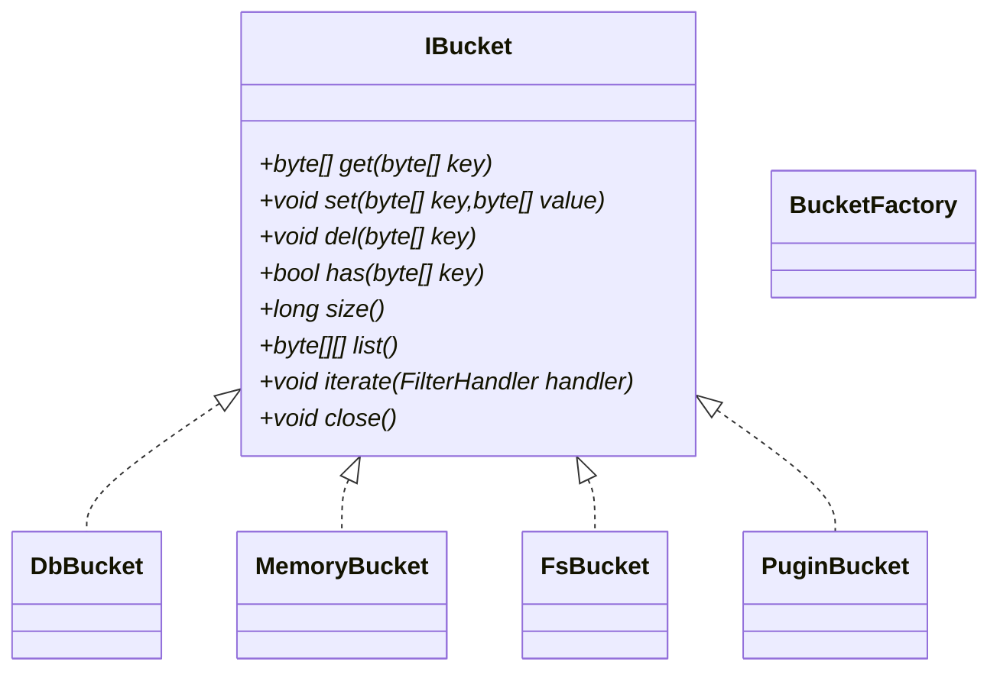

# Store相关代码调查分析

## 源代码范围

```go
modules.node.core
lib.core.storage 
lib.storage.*
lib.buckets.*
```

## 模块1

modules.node.core

**源代码**

```
package node

import (
	"github.com/nspcc-dev/neofs-node/lib/core"
	"github.com/nspcc-dev/neofs-node/lib/storage"
	"github.com/spf13/viper"
	"go.uber.org/zap"
)

func listBuckets(v *viper.Viper) []core.BucketType {
	var (
		items  = v.GetStringMap("storage")
		result = make([]core.BucketType, 0, len(items))
	)

	for name := range items {
		result = append(result, core.BucketType(name))
	}

	return result
}

func newStorage(l *zap.Logger, v *viper.Viper) (core.Storage, error) {
	return storage.New(storage.Params{
		Viper:   v,
		Logger:  l,
		Buckets: listBuckets(v),
	})
}

```

**结构分析**

```go
1.声明函数listBuckets
func listBuckets(v *viper.Viper) []core.BucketType
作用：输出所有支持的bucket类型
伪代码逻辑：
a)获取配置中storage字段对应的数据
b)循环输出数据中的bucket类型

2.声明函数newStorage
func newStorage(l *zap.Logger, v *viper.Viper) (core.Storage, error)
作用：创建一个新的Storage对象
```


## 模块2

lib.core.storage 

**源代码**

```go
package core

import (
	"github.com/nspcc-dev/neofs-node/internal"
	"github.com/pkg/errors"
)

type (
	// BucketType is name of bucket
	BucketType string

	// FilterHandler where you receive key/val in your closure
	FilterHandler func(key, val []byte) bool

	// BucketItem used in filter
	BucketItem struct {
		Key []byte
		Val []byte
	}

	// Bucket is sub-store interface
	 Bucket interface {
		Get(key []byte) ([]byte, error)
		Set(key, value []byte) error
		Del(key []byte) error
		Has(key []byte) bool
		Size() int64
		List() ([][]byte, error)
		Iterate(FilterHandler) error
		// Steam can be implemented by badger.Stream, but not for now
		// Stream(ctx context.Context, key []byte, cb func(io.ReadWriter) error) error
		Close() error
	}

	// Storage component interface
	Storage interface {
		GetBucket(name BucketType) (Bucket, error)
		Size() int64
		Close() error
	}
)

const (
	// BlobStore is a blob bucket name.
	BlobStore BucketType = "blob"

	// MetaStore is a meta bucket name.
	MetaStore BucketType = "meta"

	// SpaceMetricsStore is a space metrics bucket name.
	SpaceMetricsStore BucketType = "space-metrics"
)

var (
	// ErrNilFilterHandler when FilterHandler is empty
	ErrNilFilterHandler = errors.New("handler can't be nil")

	// ErrNotFound is returned by key-value storage methods
	// that could not find element by key.
	ErrNotFound = internal.Error("key not found")
)

// ErrIteratingAborted is returned by storage iterator
// after iteration has been interrupted.
var ErrIteratingAborted = errors.New("iteration aborted")

var errEmptyBucket = errors.New("empty bucket")

func (t BucketType) String() string { return string(t) }

// ListBucketItems performs iteration over Bucket and returns the full list of its items.
func ListBucketItems(b Bucket, h FilterHandler) ([]BucketItem, error) {
	if b == nil {
		return nil, errEmptyBucket
	} else if h == nil {
		return nil, ErrNilFilterHandler
	}

	items := make([]BucketItem, 0)

	if err := b.Iterate(func(key, val []byte) bool {
		if h(key, val) {
			items = append(items, BucketItem{
				Key: key,
				Val: val,
			})
		}
		return true
	}); err != nil {
		return nil, err
	}

	return items, nil
}

```

**结构分析**

```go
1.定义Bucket相关接口
		Get(key []byte) ([]byte, error)//按照key获取value
		Set(key, value []byte) error   //按照key设置value
		Del(key []byte) error          //按照key删除value
		Has(key []byte) bool           //按照key判断是否存在value
		Size() int64                   //获取bucket大小
		List() ([][]byte, error)       //获取所有key
		Iterate(FilterHandler) error   //获取元素迭代器
		Close() error                  //关闭bucket

2.定义Storage相关接口
		GetBucket(name BucketType) (Bucket, error)//获取Storage所包含的bucket
		Size() int64                              //获取Storage的大小
		Close() error                             //关闭Storage

3.定义错误消息类型
        ErrNotFound                               //key不存在
        ErrNilFilterHandler                       //过滤器为空
        ErrIteratingAborted                       //迭代器异常
        errEmptyBucket                            //bucket为空

4.定义bucket类型BucketType
	BlobStore
	MetaStore
	SpaceMetricsStore

5.定义BucketItem结构体
	BucketItem struct {
		Key []byte
		Val []byte
	}

6.声明函数ListBucketItems
ListBucketItems(b Bucket, h FilterHandler) ([]BucketItem, error)
作用：返回Bucket中所有元素，并用过滤器过滤。
伪代码逻辑：
a)判断bucket和过滤器是否为空
b)迭代器循环获取bucket中元素，并用过滤器过滤

```


## 模块3

lib.storage.*

**源代码**

```go
package storage

import (
	"io"

	"github.com/nspcc-dev/neofs-node/lib/buckets"
	"github.com/nspcc-dev/neofs-node/lib/core"
	"github.com/pkg/errors"
	"github.com/spf13/viper"
	"go.uber.org/zap"
)

type (
	store struct {
		blob core.Bucket

		meta core.Bucket

		spaceMetrics core.Bucket
	}

	sizer interface {
		Size() int64
	}

	// Params for create Core.Storage component
	Params struct {
		Buckets []core.BucketType
		Viper   *viper.Viper
		Logger  *zap.Logger
	}
)

// New creates Core.Storage component.
func New(p Params) (core.Storage, error) {
	var (
		err error
		bs  = make(map[core.BucketType]core.Bucket)
	)

	for _, name := range p.Buckets {
		if bs[name], err = buckets.NewBucket(name, p.Logger, p.Viper); err != nil {
			return nil, err
		}
	}

	return &store{
		blob: bs[core.BlobStore],

		meta: bs[core.MetaStore],

		spaceMetrics: bs[core.SpaceMetricsStore],
	}, nil
}

// GetBucket returns available bucket by type or an error.
func (s *store) GetBucket(name core.BucketType) (core.Bucket, error) {
	switch name {
	case core.BlobStore:
		if s.blob == nil {
			return nil, errors.Errorf("bucket(`%s`) not initialized", core.BlobStore)
		}

		return s.blob, nil
	case core.MetaStore:
		if s.meta == nil {
			return nil, errors.Errorf("bucket(`%s`) not initialized", core.MetaStore)
		}

		return s.meta, nil
	case core.SpaceMetricsStore:
		if s.spaceMetrics == nil {
			return nil, errors.Errorf("bucket(`%s`) not initialized", core.SpaceMetricsStore)
		}

		return s.spaceMetrics, nil
	default:
		return nil, errors.Errorf("bucket for type `%s` not implemented", name)
	}
}

// Size of all buckets.
func (s *store) Size() int64 {
	var (
		all    int64
		sizers = []sizer{
			s.blob,
			s.meta,
			s.spaceMetrics,
		}
	)

	for _, item := range sizers {
		if item == nil {
			continue
		}

		all += item.Size()
	}

	return all
}

// Close all buckets.
func (s *store) Close() error {
	var closers = []io.Closer{
		s.blob,
		s.meta,
	}

	for _, item := range closers {
		if item == nil {
			continue
		}

		if err := item.Close(); err != nil {
			return err
		}
	}

	return nil
}

```

**结构分析**

```go
1.定义store结构体
	store struct {
		blob core.Bucket

		meta core.Bucket

		spaceMetrics core.Bucket
	}

2.定义Params结构体，用于store组件
	Params struct {
		Buckets []core.BucketType
		Viper   *viper.Viper
		Logger  *zap.Logger
	}

3.声明函数
func New(p Params) (core.Storage, error) 
作用：创建一个Storage组件
伪代码逻辑：
a)获取bucket类型，3个
b)创建bucket对象实例，3个
c)创建Storage实例，并将3个bucket实例赋值

4.实现Storage3个接口,用(s *store)将接口实现指向store结构体
4.1.func GetBucket(name BucketType) (Bucket, error)
    作用：获取Storage所包含的bucket
    伪代码逻辑：switch(BucketType) 
              case:new 相应类型的Bucket对象
              default：
                   异常，bucket未实现
4.2.func Size() int64
    作用：获取Storage的大小
    伪代码逻辑：累加内部所有的bucket的大小
4.3.func Close() error
    作用：关闭Storage
    伪代码逻辑：关闭Storage内部所有的bucket

```


## 模块4

lib.buckets.*

**源代码**

a) init.go

b) inmemory/bucket.go

​    inmemory/methods.go

c) fsbucket/bucket.go

​    fsbucket/methods.go

​    fsbucket/queue.go

​    fsbucket/treemethods.go

​    fsbucket/treemethods_test.go

d) boltdb/boltdb.go

​    boltdb/methods.go

​    boltdb/methods_test.go

​    boltdb/plugin/main.go

**结构分析**

a) init.go

```go
1.定义bucket类型常量
	BoltDBBucket     //nosql数据库类型bucket
	InMemoryBucket   //内存类型bucket
	FileSystemBucket //文件类型bucket
	bucketSymbol     //自定义bucket

2.声明函数NewBucket
func NewBucket(name core.BucketType, l *zap.Logger, v *viper.Viper) (core.Bucket, error) 
作用：Bucket构造器
伪代码逻辑：
    switch(bucket类型)
        case:return new对应的bucket实例
        default:
            return new Plugin中的实例

```


b) inmemory.*

```go
bucket.go

1.定义bucket结构体，key string类型-value byte[]类型，线程安全
	bucket struct {
		*sync.RWMutex
		items map[string][]byte
	}

2.声明函数stringifyKey/decodeKey
func stringifyKey(key []byte) string
func decodeKey(key string) []byte
作用：key使用base58编解码

3.声明函数NewBucket
func NewBucket(name core.BucketType, v *viper.Viper) core.Bucket
作用：创建Bucket实例

4.声明函数makeCopy
func makeCopy(val []byte) []byte
作用：将byte[]复制到另一个byte[]


method.go
实现bucket接口中的方法
func (b *bucket) Get(key []byte) ([]byte, error)
func (b *bucket) Set(key, value []byte) error
func (b *bucket) Del(key []byte) error
func (b *bucket) Has(key []byte) bool
func (b *bucket) Size() int64
func (b *bucket) List() ([][]byte, error)
func (b *bucket) Iterate(handler core.FilterHandler) error
func (b *bucket) Close() error 
```


c) fsbucket.*

```go
bucket.go

1.定义结构体bucket/treeBucket
	bucket struct {
		dir  string
		perm os.FileMode
	}

	treeBucket struct {
		dir  string
		perm os.FileMode

		depth        int
		prefixLength int
		sz           *atomic.Int64
	}

2.定义文件路径/权限等常量
	defaultDirectory   = "fsbucket"
	defaultPermissions = 0755
	defaultDepth       = 2
	defaultPrefixLen   = 2

3.声明编解码函数，base58编码
func stringifyKey(key []byte) string
func decodeKey(key string) []byte

4.声明函数NewBucket
func NewBucket(name core.BucketType, v *viper.Viper) (core.Bucket, error)
作用：构建bucket实例
伪代码逻辑：
a)获取文件目录文件夹
b)获取文件权限
c)获取深度
d)获取前缀长度
e)创建文件，如果允许树形结构，则生成treeBucket类型bucket，否则生成bucket类型

method.go
实现bucket接口中的方法,数据按照文件存储，路径加文件名就是key
Eg./fsbucket/fileName

func (b *bucket) Get(key []byte) ([]byte, error)
func (b *bucket) Set(key, value []byte) error
func (b *bucket) Del(key []byte) error
func (b *bucket) Has(key []byte) bool
func (b *bucket) Size() int64
func (b *bucket) List() ([][]byte, error)
func (b *bucket) Iterate(handler core.FilterHandler) error
func (b *bucket) Close() error 

treemethod.go
实现bucket接口中的方法,将文件名的HexString按树形存储
Eg.文件名“abcdef”=>/ab/cd/abcdef

func (b *bucket) Get(key []byte) ([]byte, error)
func (b *bucket) Set(key, value []byte) error
func (b *bucket) Del(key []byte) error
func (b *bucket) Has(key []byte) bool
func (b *bucket) Size() int64
func (b *bucket) List() ([][]byte, error)
func (b *bucket) Iterate(handler core.FilterHandler) error
func (b *bucket) Close() error 

queue.go
1.定义结构体queue/elem,队列线程安全
	queue struct {
		*sync.RWMutex
		buf []elem
	}

	elem struct {
		depth  int
		prefix string
		path   string
	}

2.声明函数Push/Pop/length/new
基本压栈/出栈操作
```


d) boltdb.*

```go
boltdb.go

1.定义结构体bucket/options
	bucket struct {
		db   *bbolt.DB
		name []byte
	}

	Options struct {
		bbolt.Options
		Name []byte
		Path string
		Perm os.FileMode
	}
2.定义常量
  defaultFilePermission//文件权限
  errEmptyPath//空路径异常

3.声明函数NewOptions
func NewOptions(name core.BucketType, v *viper.Viper) (opts Options, err error)
作用：构建数据库操作参数
			Timeout:      //获取数据库资源文件的超时时间
			FreelistType: //设置Freelist类型，2种，array和hashMap，array性能差，map内存页id随机，默认是array
			NoSync:       //
			ReadOnly:     //数据库只读模式，使用读锁
			NoGrowSync:   //在内存映射文件之前设置DB.NoGrowSync标志
			NoFreelistSync: //是否把freelist同步到磁盘，提高写性能，增加恢复的代价

			PageSize:        //默认内存页
			MmapFlags:       //在内存映射文件之前设置DB.MmapFlags标志
			InitialMmapSize: //InitialMmapSize是数据库的初始mmap大小，以字节为单位。如果          InitialMmapSize足够大以容纳数据库mmap大小，则读事务不会阻止写事                                务。（有关更多信息，请参见DB.Begin。）


3.声明函数NewBucket
func NewBucket(opts *Options) (core.Bucket, error) 
作用：使用默认参数创建数据库型Bucket实例

methods.go
func (b *bucket) Get(key []byte) ([]byte, error)
func (b *bucket) Set(key, value []byte) error
func (b *bucket) Del(key []byte) error
func (b *bucket) Has(key []byte) bool
func (b *bucket) Size() int64
func (b *bucket) List() ([][]byte, error)
func (b *bucket) Iterate(handler core.FilterHandler) error
func (b *bucket) Close() error 

```


## 类继承和接口关系设计

接口

```c#
interface: IBucket{
    public byte[] Get(byte[] key) throw Exception;
    public void Set(byte[] key,byte[] value) throw Exception;
    public void Del(byte[] key) throw Exception;
    public bool Has(byte[] key);
    public long Size();
    public byte[][] List() throw Exception;
    public void Iterate(FilterHandler handler) throw Exception;
    public void Close() throw Exception;
}
```

实现类

```c#
Implement:

DbBucket:IBucket
{
  const{
    defaultFilePermission
    errEmptyPath
  }
  
  class Options{
      byte[] name
      string path
      FileMode mode
  }
   
  private name
  
  public static Options NewOptions(enum BucketType, Config config) throw Exception
  
  public DbBucket()
  
  //IBucket接口方法
  ...
}

MemoryBucket:IBucket
{
  const (
	defaultCapacity
  )
  
  private Map<string,byte[]> items
  
  public MemoryBucket()
  
  //IBucket接口方法
  ...
}

FsBucket:IBucket
{
  const (
	defaultDirectory
	defaultPermissions
	defaultDepth
	defaultPrefixLen
   )
  
  private string dir
  private FileMode mode
       
  public FsBucket();
  //IBucket接口方法
  ...
}

TreeFsBucket:FsBucket
{
  private int depth;
  private int prefixLength;
  private long size;
    
  public TreeFsBucket();
  //IBucket接口方法
  ...
}

PuginBucket:IBucket
{
  //IBucket接口方法
  ...
}
```

工具类

```c#
BucketFactory{
  public enum BucketType{
      BoltDBBucket，//数据库类型Bucket
      InMemoryBucket，//内存类型Bucket
      FileSystemBucket，//文件系统类型Bucket
      bucketSymbol   //自定义插件类型Bucket
  }
  //创建BucketType对应类型的Bucket实例
  public IBucket createBucket(enum BucketType,Logger log,Config config)

}
```





接口

```c#
interface: IStorage{
	public IBucket GetBucket(name BucketType) throw Exception
	public long Size()
	public void Close() throw Exception
}
```

实现类

```c#
Implement:
StoreStorage:IStorage{
    class Params{
        string[] bucketTypes
        Config conf;
    }
    
    public StoreStorage();
    
    public IBucket GetBucket(string name) throw Exception;
    //IStorage接口方法
}
```


## 杂项

### BoltDb和levelDb比较

**LevelDb** 

场景：适用写多读少

内部实现是LSM Tree

不支持ACID

多文件

**BoltDb** 

场景：适用读多写少

内部实现是B+ Tree

支持ACID

单文件

资料：https://www.youbbs.org/t/3210

结论：先用levelDB,未来性能优化,待调查


### 组件结构

BucketItem   (Key-value)----->Bucket------->Storage


